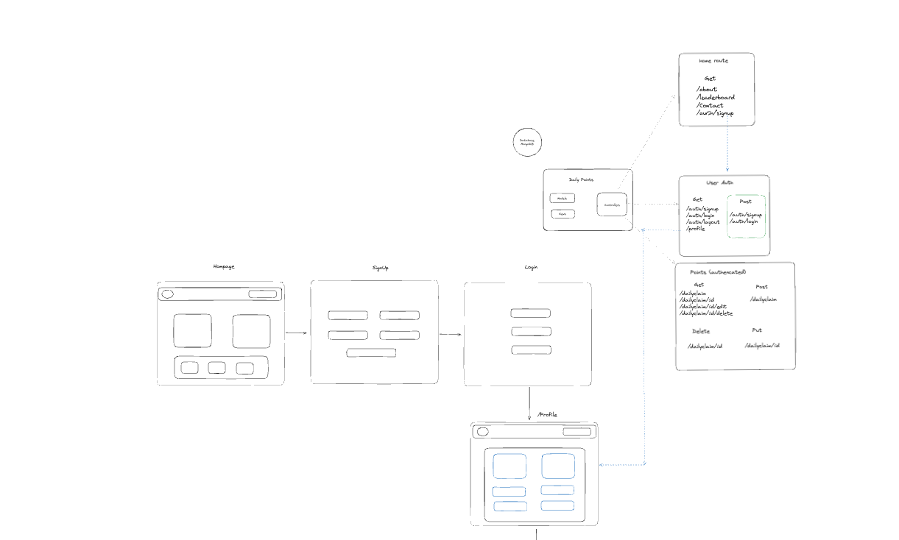
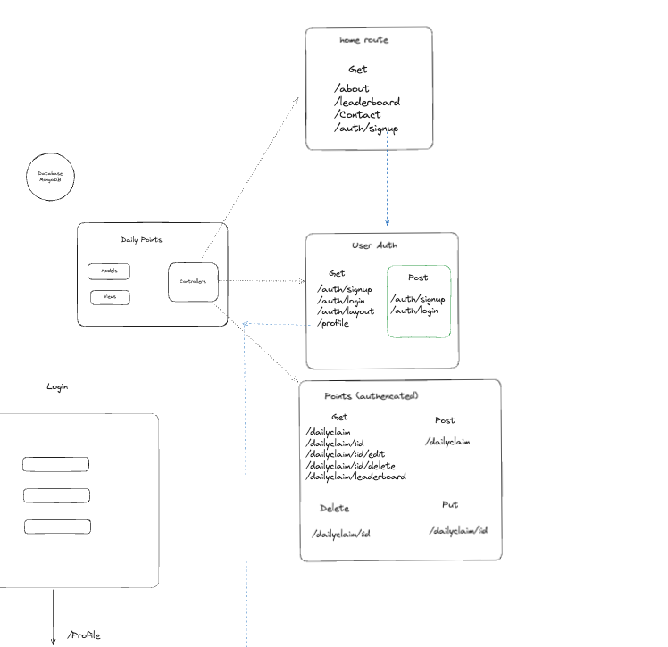
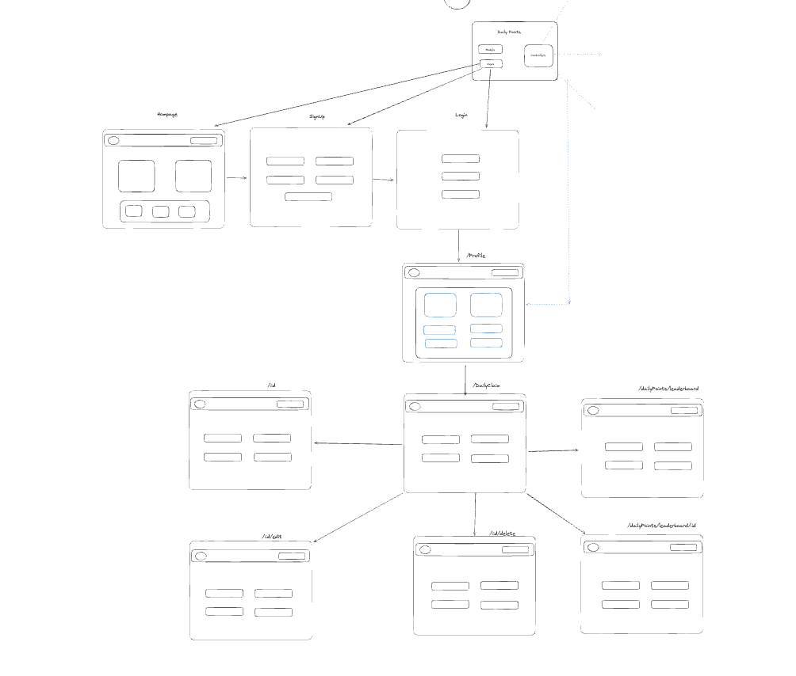
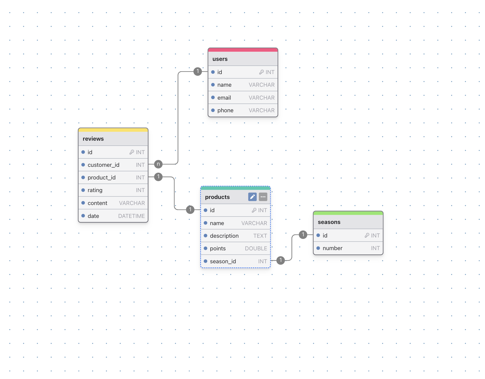

# SEI SEBPT220 Project 2: Daily Points

Daily Points is an online rewards program where users can log in daily to review digital products and earn points.

## How It Works

Registered users of Daily Points can log in every day to claim their points by reviewing digital products. Users can accumulate points to redeem for prizes and view seasonal leaderboards to see how they rank against other users.

## Features

### User Account Management

- **Create an account:** Users can register with their name, email, phone, and password.
- **Log in and log out:** Registered users can log in to their accounts to access the platform and log out when done.

### Daily Points

- **Claim points daily:** Users can log in every day to review products and earn points.
- **Redeem points for prizes:** Users can redeem accumulated points for various prizes available on the platform.

### Product Reviews

- **Submit reviews:** Users can write reviews for digital products they have used.
- **View recent reviews:** Users can see their most recent reviews and edit or delete them if needed.

### Leaderboards

- **View seasonal leaderboards:** Users can view leaderboards to see the top users with the most points for each season.

### Contact

- **Contact Form:** Users can contact the development team for product support.

## User Stories

1. **Create an account:**
   - As a user, I want to register with my personal details so I can start using the platform.
2. **Claim points daily:**
   - As a user, I want to log in daily to review products and earn points.
3. **Redeem points for prizes:**
   - As a user, I want to use my points to redeem for prizes.
4. **View seasonal leaderboards:**
   - As a user, I want to see the top users of the season to know where I stand.

## Setup Instructions for Local Deployment

To set up this project locally, follow these steps:

1. **Clone the repository:**

   ```bash
   git clone https://github.com/your-username/daily-points.git
   ```

2. **Navigate to the project directory:**

   ```bash
   cd daily-points
   ```

3. **Install dependencies:**

   ```bash
   npm install
   ```

4. **Set up the environment variables:**

   - Create a `.env` file in the root directory.
   - Add the following environment variables:
     ```
     PORT=3000
     MONGODB_URI=your_mongodb_connection_string
     SECRET_KEY=your_secret_key
     ```

5. **Run the application:**

   ```bash
   npm start
   ```

6. **Open your browser and visit:**
   ```
   http://localhost:3000
   ```

## Live Demo

[Live Demo Site](https://daily-points.onrender.com/)

## Models

### User

- **name:** String
- **id:** Number
- **email:** String
- **phone:** String
- **password:** String
- **points:** Number

### Reviews

- **id:** Number
- **customer_id:** Number
- **product_id:** Number
- **rating:** Number
- **content:** String
- **date:** Date

### Points

- **id:** Number
- **date:** Date
- **customer_id:** Number
- **amount:** Number
- **product_id:** Number

### Season

- **id:** Number
- **number:** Number

### Products

- **id:** Number
- **image:** String
- **description:** String
- **points:** Number
- **season_id:** Number

## Code Snippets

### Contact Route API Handling

```js
app.post("/contact", (req, res) => {
  const { fullName, email, phone, subject, message } = req.body;

  // Validate form data
  if (!fullName || !email || !subject || !message) {
    req.flash("error", "Incomplete Contact info");
    return res.status(400).redirect("/contact");
  }

  // Check if required environment variables are present
  if (!process.env.EMAIL_FROM || !apikey) {
    req.flash("error", "Missing environment variables");
    return res.status(500).redirect("/contact");
  }
  const emailsApi = new ElasticEmail.EmailsApi();

  const emailData = {
    Recipients: [
      {
        Email: process.env.EMAIL_FROM,
        Fields: {
          name: fullName,
        },
      },
    ],
    Content: {
      Body: [
        {
          ContentType: "HTML",
          Charset: "utf-8",
          Content: `<p>Name: ${fullName}</p><p>Email: ${email}</p><p>Phone: ${phone}</p><p>Message: ${message}</p>`,
        },
      ],
      From: process.env.EMAIL_FROM,
      Subject: subject,
    },
  };

  const callback = (error, data, response) => {
    if (error) {
      req.flash("error", "Error sending email");
      return res.status(500).redirect("/contact");
    } else {
      req.flash("success", "Email sent");
      return res.status(200).redirect("/");
    }
  };

  emailsApi.emailsPost(emailData, callback);
});
```

### Recent Review Query

```js
// Find the most recent review for the user
const recentReview = await Review.findOne({ customer_id: _id }).sort({
  createdAt: -1,
});
let recentProduct = {};

if (recentReview) {
  // Find the product associated with the most recent review
  const recentReviewedProduct = await Product.findOne({
    _id: recentReview.product_id,
  });
  if (recentReviewedProduct) {
    recentProduct = {
      title: recentReviewedProduct.title,
      id: recentReviewedProduct.id,
      image: recentReviewedProduct.image,
    };
  }
}
```

## API

- [FakeStore Api](https://fakestoreapi.com/)
- [ElasticMail Api](https://elasticemail.com/developers/api-documentation/rest-api)

## Inspiration

- [Twice Daily Rewards](https://twicedaily.com/rewards/)
- [InboxDollars](https://www.inboxdollars.com/)

## Mockups






[Excalidraw Mockup](https://excalidraw.com/#json=vmVDnChu3kJT34AJRSpbp,d2nAkflCj85Uhd7vuxLkKA)

```

```
